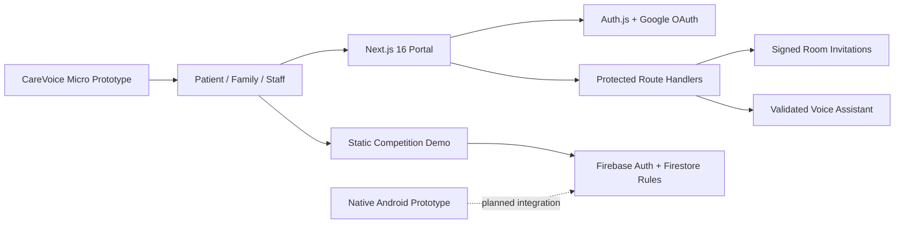

# CareVoice AI

CareVoice is a voice-first elderly-care prototype built for the HKICT Awards 2026 Student Innovation category. It provides role-specific experiences for patients, family members, and medical staff, with bilingual voice logging, triage support, care coordination, and an auditable demo workflow.

> **DEMO ONLY - NOT HIPAA COMPLIANT.** Do not enter real patient data. CareVoice is not a medical device, diagnostic system, emergency service, or replacement for clinical judgment.

## Product Surfaces

| Surface | Purpose | Entry point |
| --- | --- | --- |
| Next.js portal | Authenticated patient, family, and staff workflows | `npm run dev` |
| Static competition demo | Offline-friendly voice capture, Judge Mode, evidence exports, and Firebase sync | `index.html` |
| Native Android prototype | Separate dependency-light mobile experience, not a WebView | `carevoice-android/` |
| CareVoice Micro | Interactive bedside-controller concept and 3D product demo | `carevoice-micro.html` |

The Next.js portal is the recommended application path. The static app remains for reliable offline demonstrations and contains explicit prototype-security warnings.

## Current Features

- Cantonese and English voice capture and guided prompts
- Rule-based medication, symptom, and urgent-phrase categorization
- Optional server-side Gemini assistance with structured output and a local safety fallback
- CareVoice Micro control hub with NFC profile loading, medication acknowledgement, nurse escalation, family contact, network recovery, and an audit timeline
- Large-control social memory game designed for the Micro joystick
- Patient, family, and medical-staff portals
- Calendar, care-team, handoff, alert, and clinical-workflow views
- Auth.js Google sign-in with server-authoritative roles
- Server-signed room invitations bound to recipient email and role
- Authenticated voice-assistant API with Zod validation and rate limiting
- CSV, FHIR-style, and eHRSS-ready prototype exports
- Repeatable three-minute Judge Mode
- Native Android and CareVoice Micro companion prototypes

## Architecture



The repository intentionally contains both a server-backed Next.js application and a legacy static application. They share product concepts but not a common runtime security boundary.

## Quick Start: Next.js Portal

### Requirements

- Node.js 20.9 or later
- npm
- Google OAuth credentials for authenticated portal testing

```bash
git clone https://github.com/ODd-line/CareVoice-AI.git
cd CareVoice-AI
npm install
cp .env.example .env.local
npm run dev
```

Open [http://localhost:3000](http://localhost:3000).

Configure `.env.local`:

```env
AUTH_SECRET=replace-with-a-long-random-secret
GOOGLE_CLIENT_ID=replace-with-google-client-id
GOOGLE_CLIENT_SECRET=replace-with-google-client-secret
CAREVOICE_STAFF_EMAILS=staff@example.com,nurse@example.com
GOOGLE_GENERATIVE_AI_API_KEY=
CAREVOICE_GEMINI_MODEL=gemini-2.5-flash
```

- `AUTH_SECRET` signs Auth.js sessions and room invitations.
- `CAREVOICE_STAFF_EMAILS` is the server-side allowlist for staff access.
- `GOOGLE_GENERATIVE_AI_API_KEY` is optional and enables bounded Gemini replies through the protected server route.
- `CAREVOICE_GEMINI_MODEL` selects the Gemini model; the assistant falls back to deterministic local safety responses when the model is absent or unavailable.

Generate a production secret with `openssl rand -base64 32`.

## Static Competition Demo

Run the static app with VS Code Live Server or another local HTTP server:

```bash
npx serve .
```

Open `index.html`. Chrome or Edge is recommended for speech recognition. Microphone access requires HTTPS outside localhost.

The static app uses browser Web Crypto AES-GCM only as prototype device-storage protection. It does not provide managed key storage, production authorization, or healthcare compliance.

## Firebase Setup

1. Create a Firebase project and enable Firestore and Google Authentication.
2. Register a web app and place its public web configuration in `firebase-config.js`.
3. Add localhost and deployment domains under **Authentication > Settings > Authorized domains**.
4. Publish the rules from `firestore.rules`.
5. Restrict the public Firebase web key to approved referrers in Google Cloud Console.

Firebase web API keys are public identifiers, not server secrets. Never add service-account keys, OAuth client secrets, or private server credentials to browser code.

## Security Model

### Enforced by the Next.js portal

- The signed Auth.js session is the source of truth for `patient`, `family`, and `staff` roles.
- Client cookies and local storage cannot grant portal authorization.
- Staff selection requires the signed-in email to appear in `CAREVOICE_STAFF_EMAILS`.
- Portal layouts enforce authentication and role access on the server.
- Room invitations use HMAC-SHA256 signatures with room, recipient, role, nonce, and expiry claims.
- Room details render only when invitation claims match the active session.
- Protected APIs reject unauthenticated and malformed requests.

### Known production gaps

- Room invitations are time-limited but not consume-once. Single-use enforcement requires a shared transactional nonce store.
- API rate limiting is process-local. Multi-instance deployment requires shared storage such as Vercel KV or Upstash Redis.
- The static Firebase application is a demonstration surface, not a production healthcare authorization boundary.
- Production use requires formal privacy, consent, retention, incident-response, accessibility, and clinical-safety review.

The static app retains legacy role values (`hospital_staff` and `family_member`) for stored-profile compatibility and maps them to the canonical server roles (`staff` and `family`). New server authorization code must use `lib/roles.ts`.

## Validation

```bash
npm test
npm run lint
npm run typecheck
npm run build
npm audit --omit=dev
```

The security suite covers anonymous denial, forged role cookies, signed-role mismatch, invitation identity and expiry, legacy and tampered tokens, and voice API `401`/`400` responses.

## Deployment

```bash
npm install -g vercel
vercel login
vercel --prod
```

Configure every value from `.env.example` in the deployment platform's encrypted environment settings. Add the deployed URL to Google OAuth and Firebase authorized domains.

The production build uses Webpack through `next build --webpack` because the current macOS development environment blocks Turbopack's internal PostCSS worker port.

## Native Android App

Open `carevoice-android/` in Android Studio and run the `app` configuration. See [carevoice-android/README.md](carevoice-android/README.md) for Firebase registration and integration notes.

## Repository Map

```text
app/                    Next.js App Router pages and protected APIs
components/             Portal UI and role-aware features
lib/                    Roles, invitation signing, schemas, and mock data
tests/                  Vitest security and request-validation tests
public/assets/          Next.js role imagery
carevoice-android/      Native Android prototype
carevoice-micro.*       Bedside-controller concept demo
app.js + *.html         Static competition and Firebase demo
firestore.rules         Static-app Firestore rules
```

## 🏆 HKICT Alignment
| Criteria | Implementation |
|----------|----------------|
| Innovation | Voice-first triage plus caregiver handoff workflow |
| Impact | Reduces missed medication notes, symptom drift, and manual re-logging |
| UX/Buy-in | Zero-learning interface, bilingual flow, judge-mode demo path |
| Ethics | Clear non-diagnostic disclaimer, human-in-the-loop escalation, scoped data capture |
| Market | NGO / clinic / family caregiver pilot with exportable audit trail |

## 🎯 Competition-Safe MVP Scope
The version in this repo is deliberately narrow so it can be finished, tested, and shown live:
1. Elderly user speaks in Cantonese or English.
2. The app labels the note as medication, symptom, or emergency.
3. The caregiver workspace stores the record, brief, and evidence CSV.
4. Judge Mode plays a repeatable 3-minute demo without needing a real patient.

That is enough to demonstrate function, social impact, and product readiness without overpromising clinical AI.

## 🧭 How the Product Actually Works
1. Open the home page and go to the Voice Capture Studio.
2. Speak naturally in Cantonese or English, or use Judge Mode to seed a realistic demo sequence.
3. The app classifies the input into medication, symptom, or emergency and writes a local log.
4. The member workspace turns those logs into a short brief and an exportable CSV for judges or caregivers.

Judge Mode is intentionally local-first so it still works when Firebase login is not available on stage.

## 🏅 What Past HKICT Student Innovation Winners Tend to Look Like
Public past winners show a clear pattern:
- 2025: ArtInSight, a focused AI art learning platform with a specific learning workflow.
- 2023: Meditech, a medication-adherence solution aimed at a real elderly-care pain point.
- 2022: A human-in-the-loop cobot system with a clear industrial workflow and practical deployment story.

The common thread is not “AI everywhere.” It is a narrow problem, a working prototype, measurable impact, and a credible deployment path. That is the standard this project should keep matching.

## 📌 Official Rule Signals (HKICT 2025/2026 FAQ + EdCity)
- Student Innovation judging weights (Senior Secondary / Higher Education):
  - Innovation and Creativity: 25%
  - Functionality and Performance: 30%
  - Market Potential / Performance: 10%
  - Quality: 20%
  - Social Impact: 15%
- Presentation language can be English, Cantonese, or Putonghua (declare in application)
- Equipment setup time is 3 minutes; overrun reduces presentation time
- Category judging presentation + Q&A is around 20-30 minutes (LO dependent)
- Grand judging uses 15-minute presentation + 10-minute Q&A
- Own device/video demo is allowed
- No strict limit on presenter count (but reasonable team size recommended)
- Best Use of AI is optional and at most one per category; must declare AI/AIGC use in form

## 🎯 Stand-Out Strategy (Ethical Competitive Advantage)
1. Optimize for the 30% Functionality score first
	- Live voice demo in Cantonese and English
	- Show emergency trigger + caregiver escalation in one pass
	- Use the in-app 3-minute Judge Mode to prove execution discipline

2. Use setup-time rule to your advantage
	- Pre-open browser tab and preload microphone permissions before your slot
	- Use one-click Judge Mode start to avoid losing time

3. Maximize AI award chance without overclaiming
	- Explicitly state: AI is assistive, human-in-the-loop, not diagnosis
	- Show AI risk handling, data minimization, and disclaimer in live flow

4. Convert soft claims into hard evidence
	- Use the Evidence Dashboard counters in live judging
	- Export CSV on the spot to prove auditability and reproducibility

5. Use bilingual presentation as a differentiation edge
	- 60 seconds Cantonese user scenario
	- 60 seconds English caregiver summary scenario
	- Shows inclusivity and practical HK deployment readiness

## 📝 Pilot & Submission Tips
- Record a 3-minute Stage-1 demo and a full 15-minute Grand-judging version
- Collect SUS usability scores (target >75; current demo target 82)
- Include architecture diagram, threat model, and data flow in submission PDF
- Keep AI as "assisted tool only" and include limitations statement
- Bring one technical presenter + one market presenter for balanced Q&A coverage
