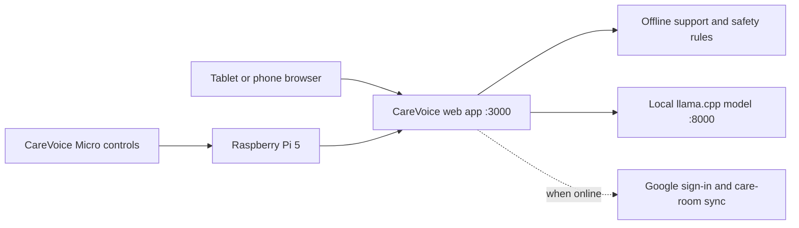

# CareVoice Micro Raspberry Pi Appliance

This package turns a Raspberry Pi microSD card into a self-contained CareVoice Micro hub. The card holds:

- the standalone CareVoice Next.js application;
- the official deterministic support and urgent-symptom rules;
- a quantized CareVoice Qwen 1.5B GGUF model;
- the `llama.cpp` inference server;
- systemd services that start the model and web app after boot;
- a private service token generated independently on each installed device.



## Recommended hardware

- Raspberry Pi 5 with 8 GB RAM minimum; 16 GB gives more headroom
- Active cooling
- 64 GB or larger high-endurance A2 microSD card
- Official USB-C power supply
- Ethernet for a ward installation; Wi-Fi is acceptable for demonstrations

The Pi model is intentionally smaller than the hospital-server model. Use `Qwen/Qwen2.5-1.5B-Instruct` with Q4_K_M quantization. A 3B BF16 model is not appropriate for responsive CPU-only bedside use.

## What works offline

- Homepage and CareVoice product interface
- Customer-support fallback knowledge
- Local support-model responses
- Deterministic urgent symptom and medication safety rules
- Local Micro controls and queued events implemented by the web application

Google sign-in, remote family contact, WhatsApp handoff, cloud room invitations, and synchronization still need network access. A production fully offline ward deployment requires a hospital identity provider or a separately reviewed local authentication design; this package does not weaken Auth.js to bypass that requirement.

## 1. Fine-tune the Pi model

Run training on a Linux NVIDIA GPU server, not on the Pi:

```bash
cd carevoice-llm
python train.py \
  --model Qwen/Qwen2.5-1.5B-Instruct \
  --output-dir artifacts/carevoice-qwen-1.5b-lora
python merge.py \
  --adapter artifacts/carevoice-qwen-1.5b-lora \
  --output artifacts/carevoice-qwen-1.5b-merged
```

The bundled sample dataset proves the pipeline only. Replace it with reviewed, consented, de-identified training material and pass the safety evaluation before preparing cards.

## 2. Export GGUF and build llama.cpp

Build a recent `llama.cpp`. The final `llama-server` binary must target 64-bit Raspberry Pi OS (`aarch64-linux`), not macOS.

```bash
./carevoice-edge/export-pi-model.sh \
  ./carevoice-llm/artifacts/carevoice-qwen-1.5b-merged \
  /path/to/llama.cpp
```

The output is `carevoice-edge/models/carevoice-qwen-1.5b-q4_k_m.gguf`.

## 3. Create the offline bundle

Run this on the Pi or another ARM64 Linux builder with Node.js 20 or later. Pass the Linux ARM64 `llama-server` binary:

```bash
./carevoice-edge/make-bundle.sh \
  ./carevoice-edge/models/carevoice-qwen-1.5b-q4_k_m.gguf \
  /path/to/llama.cpp/build/bin/llama-server
```

This produces `carevoice-edge/dist/carevoice-bundle.tar.gz`. The archive contains the web runtime, static assets, model, inference binary, installer, and startup services. It does not need npm or model downloads after it is created.

## 4. Prepare the golden microSD card

1. Flash 64-bit Raspberry Pi OS Lite to a microSD card.
2. During imaging, configure Wi-Fi if needed, enable SSH only for controlled setup, and use a unique administrator password.
3. Install Node.js 20+, `curl`, `openssl`, and Avahi in the base image.
4. Copy and extract `carevoice-bundle.tar.gz` onto the Pi.
5. Run `sudo ./carevoice-bundle/install.sh ./carevoice-bundle`.
6. Run `sudo ./carevoice-bundle/verify.sh` after both services start.
7. Open `http://carevoice-micro.local:3000` from a device on the same network.
8. Shut the Pi down cleanly. That provisioned card is the golden preloaded CareVoice image and can be duplicated with an approved disk-imaging tool.

Do not distribute cards containing real patient information, OAuth secrets, or a shared model-service token. The installer creates a unique local token and Auth.js secret on every appliance.

## Operations

```bash
sudo systemctl status carevoice-model carevoice-web
sudo journalctl -u carevoice-model -u carevoice-web --since today
sudo systemctl restart carevoice-model carevoice-web
```

Model access is bound to `127.0.0.1`; only the local Next.js server can call it. The web app is available on port 3000 to the ward LAN. Put the device on an isolated network segment before any clinical pilot.